# 背景介绍

这个仓库是对论文[^1]的复现，文章的核心是实现了三种接口的算法，将不同方向的柱拼接在了一起，构成一个由圆柱和接口组成的晶格。

# 实现原理

核心算法分为四个部分：

1. 确定接口外包球的大小。
2. 从众多连接接口的圆柱方向中不断寻找最邻近的三个方向，构造由这三个接口计算出他们的内接圆锥并计算出对应的参数。文中介绍了Projection-based boundary evaluation和Plane-rolling boundary evaluation。（之后的算法主要采取后者）例如下图中，经过这一步后，需要计算出ABC三个面需要相连而ABD不需要相连，之后计算ABC中间的三角形与三条椭圆锥边的参数。
3. 从这些参数中通过各种方法构造出各种接口，即文中的CHoCC接口，CNT接口，ACHoCC接口。
4. 最后拼接为一个网格。

下面我们分别介绍这三个步骤。

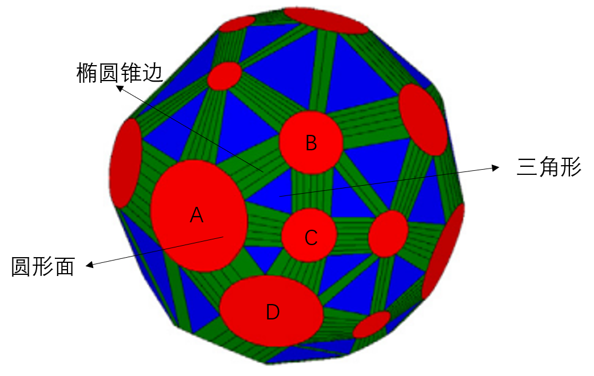

## 步骤1 

我们需要确认一个接口外包球的半径，这个半径要使得不同圆柱与球的截面不相交。具体方案为

```
n=圆柱的数目
r=-inf
for(i=0;i<n;i++)
	for(j=i+1;j<n;j++)
		d=计算圆柱i与圆柱j的交点距离球心的距离
		r=max(r,d)
r=2*r//适当扩大球的半径
```

## 步骤2

步骤2总体上可以分为两个问题，一是确定哪三个圆形面需要相连，二是计算出三角形与椭圆锥边的参数。主要方法为Projection-based boundary evaluation或者Plane-rolling boundary evaluation，之后我们会简要介绍文章提及的如何计算椭圆锥的参数。

### Projection-based boundary evaluation

关于这个方法的具体步骤为：

1. 将球上的圆通过平射投影映射到平面

2. 计算这些平面上的圆的 Apollonius 图的顶点。[^4]

3. 计算该Apollonius图的顶点在最近的 3 个圆盘上的最近投影。

4.  将这些三角形的点逆平射投影到球。

该方法问题、的是其投影会产生比较严重的形变，靠近上极点的圆形半径会非常大，如果恰好有圆经过了球的极点，圆心将会跑到无穷远的地方，球会退化为直线，这样在编程的时候会多出非常多的情况，不方便讨论。因此本文后面放弃该方法，采取了Plane-rolling boundary evaluation。

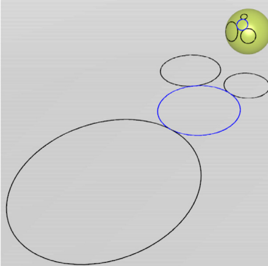

### Plane-rolling boundary evaluation

本质上，Plane-rolling boundary evaluation是一种贪婪算法，不断的寻找与当前面夹角最小的面作为新的面。Plane-rolling boundary evaluation总体上分为两步：先初始化，找到第一个三角形，再计算出其他的三角形位置。

具体步骤如下：

1. 随机选择一个圆形面，记为面$C_i$。遍历所有面$(C_j,C_k)$（其中$ijk$互不相同）计算出他们中间的三角形面，记为$T_{ijk}$。选择$(j,k)$使得$T_{ijk}$与$C_i$的夹角最小。则这个$T_{ijk}$为我们寻找的第一个三角形。

2. 建立字典$M$与栈$S$。字典$M$记录椭圆锥边被访问的次数，每当有新的三角面被加入，字典中运行

   ```
   M[椭圆锥1]=M[椭圆锥1]+1
   M[椭圆锥2]=M[椭圆锥2]+1
   M[椭圆锥3]=M[椭圆锥3]+1
   ```

   栈$S$记录三个椭圆锥边与三角面$T$的法向量，每当有一个三角面$T$被选中，在字典中查找这三条椭圆锥边的访问次数，如果该椭圆锥边第一次被访问，则加入到栈里面。如果该椭圆锥边已经被访问过，则不必加入到栈之中。即每当有新的三角面被加入，栈中运行

   ```
   if(M[椭圆锥1]==0)
   	S.push(椭圆锥1，三角面T的法向量)
   if(M[椭圆锥2]==0)
   	S.push(椭圆锥2，三角面T的法向量)
   if(M[椭圆锥3]==0)
   	S.push(椭圆锥3，三角面T的法向量)
   ```

3. 一开始，我们将步骤1中的第一个三角形记录到字典$M$与栈$S$。

4. 在栈S中取出边，在字典中检查该边是否被访问过两次以上，如果是，则抛弃该边，取出下一条边。如果不是，记录这条椭圆锥边的两端圆形面为$i,j$，其之前记录的三角面的法向量为$V$。寻找$k$，使得$T_{ijk}$的法向量与$V$的夹角最小并且椭圆锥边最多被访问一次。

5. 在字典与栈中按照2规则记录这次访问。重复3知道栈中没有边为止。 

   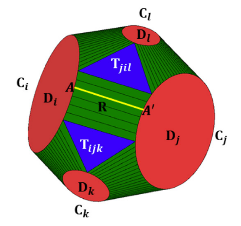

在这里面有个关键的算法，即如何从确定的三个圆形面$C_i,C_j,C_k$计算出三角形$T_{ijk}$，文章给出了详细的数学推导，此处只给出计算结果。如果这三个圆形面对应的圆锥半角为$\alpha_i,\alpha_j,\alpha_k$，法向量为$N_i,N_j,N_k$，则三角形$T_{ijk}$的法向量$N$与对应三个点$P_i$的表达式为
$$
N=\cos\alpha A-\sin\alpha B\\
P_i=O+\frac{r(\sin\alpha_i N+\sin\alpha N_i)}{\sin{(\alpha+\alpha_i)}}
$$
其中
$$
\alpha=atan{\frac{A\cdot B \pm\sqrt{(A\cdot B)^2-(A\cdot A-1)(B\cdot B-1)}}{B\cdot B-1}}\\
A=\frac{\cos\alpha_1(N_2\times N_3)+\cos\alpha_2(N_3\times N_1)+\cos\alpha_3(N_1\times N_2)
}{N_1\cdot (N_2\times N_3)}\\
B=\frac{\sin\alpha_1(N_2\times N_3)+\sin\alpha_2(N_3\times N_1)+\sin\alpha_3(N_1\times N_2)
}{N_1\cdot (N_2\times N_3)}\\
$$
$\alpha$中的$\pm$取决于是外切圆锥还是内切圆锥。

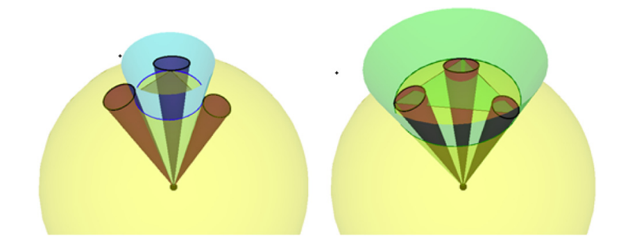

### 椭圆锥边的计算

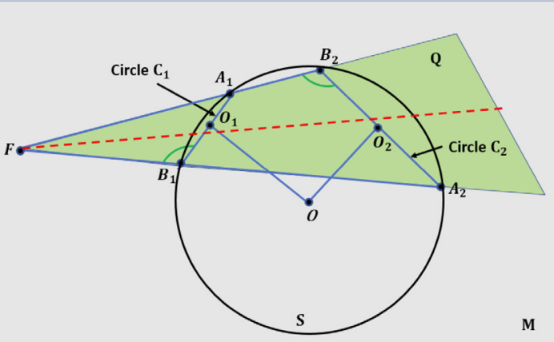

通过两个已知的共球的圆，计算椭圆锥的顶点可能有助于我们理解这个图形，尽管后续程序中我们并没有使用到该顶点。

计算步骤如下：
$$
N_1=\hat{OO_1},N_2=\hat{OO_2},N=\hat{(N_1\times N_2)}\\
A_1=O_1-r_1(N_1\times N),B_1=O_1+r_1(N_1\times N)\\
A_2=O_2-r_1(N_2\times N),B_2=O_2+r_2(N_2\times N)\\
d_1=2r_1,d_2=2r_2,d_3=|A_1B_2|,d_1=2|A_2B_1|,\\
|FA_1|=\frac{d_1(d_1d_3+d_2d_4)}{d_2^2-d_1^2}\\
F=A_1+|FA_1|\hat{B_2A_1}
$$

## 步骤3

### CHoCC接口

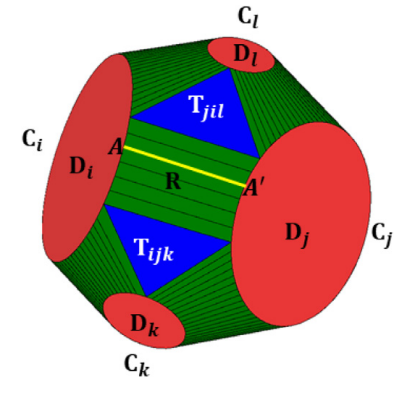

CHoCC接口直接将圆形面，椭圆锥边和三角形绘制出来即可。不需要进一步采样为各种多边形。而之后关于如何将该图形转换为obj文件的细节，见下文的`obj展示`。

### CNT接口

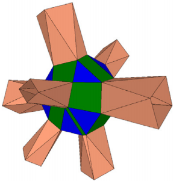

这个方法是CHoCC的极简近似，将椭圆锥面用一个四边形代替，将圆形面使用凸多边形代替，从而实现CNT接口的近似。

### ACHoCC接口

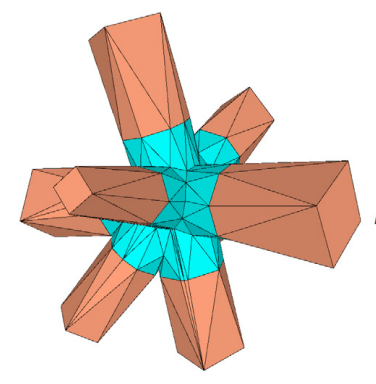

这个方法是对CNT的进一步改造。

首先，在所有的CNT椭圆锥边（实际上是四边形）的边中点，，面中心插入一个点，把四边形分为8个三角形。其次在大三角的边中间上插入一个点，把三个插入的点连接，将大三角形剖分为3个小三角形（如下图所示）。

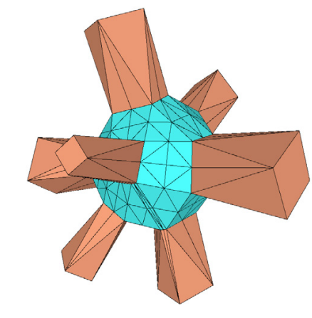

之后，我们对插入的点进行调整，首先先投影到圆面上。

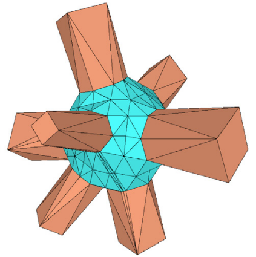

其次再投影到晶格的边界，这样即可得到ACHoCC。在文中，晶格的边界由以下公式定义
$$
d(P)=-\frac{In\sum_{i=1}^{n}\exp{(-bd_i(P))}}{b}
$$
其中$d(P)=0$的时候说明P点在晶格的表面，$d_i(P)$为该点对第$i$个圆柱的符号距离，具体计算可以参考[^2]中的cone-sphere distance。我们采取二分法求取P的位置。

```
P1=球心，P2=初始在球上的投影
a0=0，a1=1
while(a1-a0<0.01)
	mid=(a0+a1)/2
	if(d(mid*P1+(1-mid)P2)>0)
		a1=mid
	else
		a0=mid
```

在这里参数$b$的作用是调节连接的平滑程度，b越小越平滑。如果我们取极限，$b->+\infin$,这个公式形成的面退化为几个圆柱面的外包络面。

### 末端点的插入

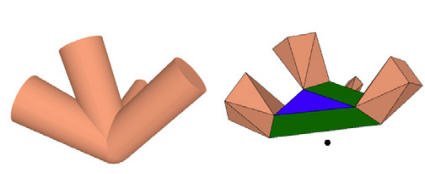

当球心不在圆柱的中间时候容易导致接口扁平甚至退化为一个面（这会导致3d打印时的断裂）。为了避免这种情况的发生，我们在球的另一侧加入一个点。

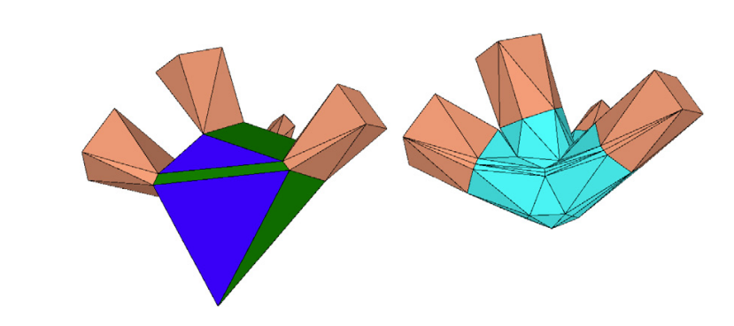

再次之后再进行ACHoCC的操作，才能得到一个更加健壮的图形。

### obj展示

这里我们讨论的是如何将我们上面讨论的图形展示位obj文件。

在前面的介绍中，我们使用了多边形，圆面，椭圆锥边等。然而对于obj文件，我们只能直接的展示三角形，因此，将不同形状切割为小三角形至关重要，否则我们难以在软件中展示。

#### 多边形切割

CNT中出现了四边形或多边形，我们采取最简单的切割方法，将所有没有连接第一个点的点依次与第一个点相连，构造出三角形。

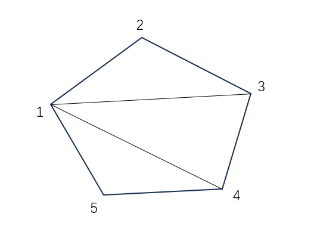

obj文件写入

```
1,2,3
1,3,4
...
1,n-1,n
```

#### 圆形切割

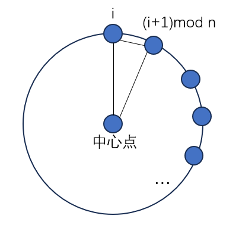

对于一个空间中的圆形来说，我们记他所在的面的法向量为V0，我们先计算出单位向量V1,V2，使得V0,V1,V2都互相垂直。

之后我们按照以下公式生成围绕中心分布的n个点
$$
P(i)=R(\sin(\frac{2\pi}{n}i)\vec{V1}+\cos(\frac{2\pi}{n}i)\vec{V2})\\
i=0,1,...,n-1
$$
按照

```
中心点,P(0),P(1)
中心点,P(1),P(2)
...
中心点,P(n-1),P(0)
```

写入obj文件即可生成圆形面。

#### 椭圆锥边切割以及面边缘链接

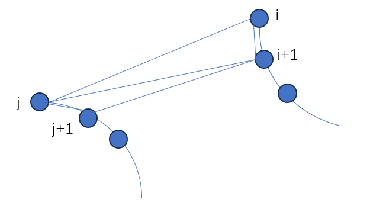

在这一步的链接中，我们要处理的是椭圆锥边，或者我们可以将问题改为，连接两个圆弧。

我们先将圆弧均匀划分，假设圆弧A划分后有n1个点，圆弧B划分后有n2个点，都从1开始编号。

```
i=1,j=1
while(i<n1&&j<n2)
	if(i/n1<j/n2)
        写入面(i,i+1,j)
        i=i+1
	else
		写入面(j,j+1,i)
        j=j+1
while(i<n1)
	写入面(i,i+1,j)
	i=i+1
while(j<n2)
	写入面(j,j+1,i)
    j=j+1
```


按照这样的划分即可将椭圆锥划分为多个三角形面。当然同样的算法也可以将各种类型的曲线链接为面，例如步骤3中的圆链接为圆柱，CNT接口中链接多边形等。

## 步骤4

再这个步骤中，我们需要把多个接口连接成为网格，具体来说，我们采取以下的思路连接两个圆形面

```
输入：接口1的点列表p1s[]，接口2的点p2s[]，接口1圆形面的圆心，接口2圆形面的圆心，连接的方向V0，

算法：
计算出单位向量V1,V2，使得V0,V1,V2都互相垂直
以接口1圆形面的圆心的为原点，V1,V2为x轴，y轴，将p1s上的点全部投影到上面。计算每个点的方位角，并按照方位角从小到大排序。
以接口2圆形面的圆心的为原点，V1,V2为x轴，y轴，将p2s上的点全部投影到上面。计算每个点的方位角，并按照方位角从小到大排序。
将这些点按照步骤3中的“椭圆锥边切割以及面边缘链接”中的方法链接。
```

# 效果展示[^3]

所有文件在main.cpp中即可直接运行，安装环境见下文开源声明与环境配置。

1. 运行CHoCCInterface，你可以得到文件`./result/CHoCCInterface.obj`，展示论文fig.3(c)。
2. 运行CNTInterface，你可以得到文件`./result/CHoCCInterface.obj`，展示论文fig.15(c)。
3. 运行ACHoCCInterface,你可以得到`./result/ACHoCCInterface.obj`，展示论文fig.19。在这个方法中你可以调节参数b（b的作用见论文fillet-surface，主要用于调节连接曲面的平滑程度）与是否加入补充点（an additional circle of infinitesimal radius）。
4. 你可以修改配置文件地址参数`dir_address`或自己编写`textshape.txt`，展示不同的方向的接口。编写规则详见`./data/Readme.md`。本仓库已经提供了3接口，4接口，6接口，8接口等的范例。
5. 运行CHoCCMesh，你可以得到`./result//CHoCCMesh.obj`，展示论文fig.2。
6. 运行CNTMesh，你可以得到`./result/CNTMesh.obj`，展示论文fig.13。

运行结果如下所示：

|                 | 3接口                                                        | 6接口                                                        | 8接口                                                        |
| --------------- | ------------------------------------------------------------ | ------------------------------------------------------------ | ------------------------------------------------------------ |
| CHoCCInterface  |  | 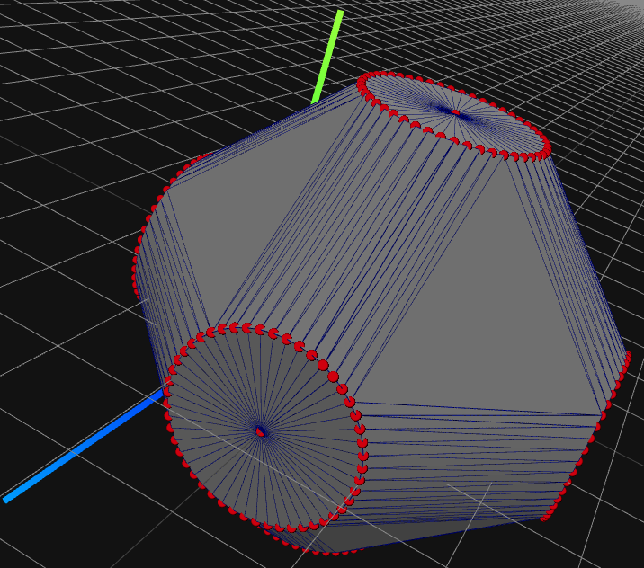 | 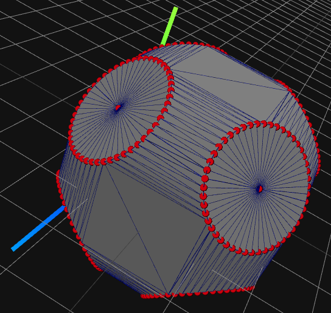 |
| CNTInterface    | 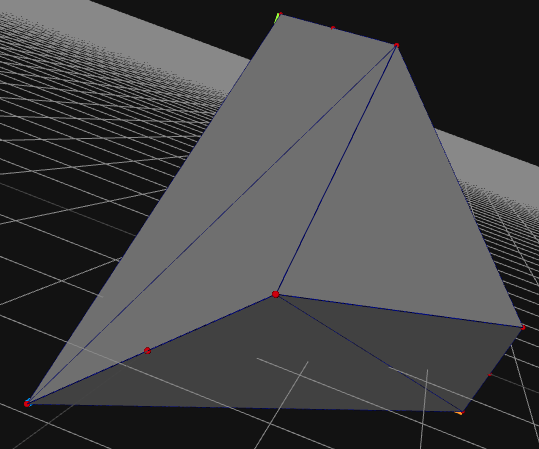 | 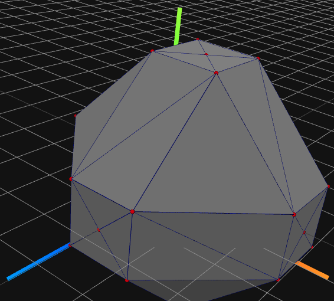 | 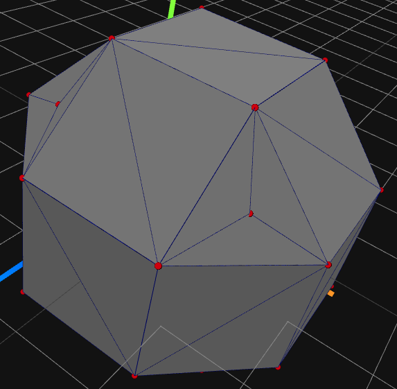 |
| ACHoCCInterface | 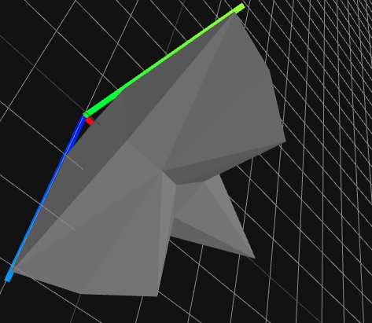（这里程序已经自动在背面加入一个半径非常小的圆柱） | 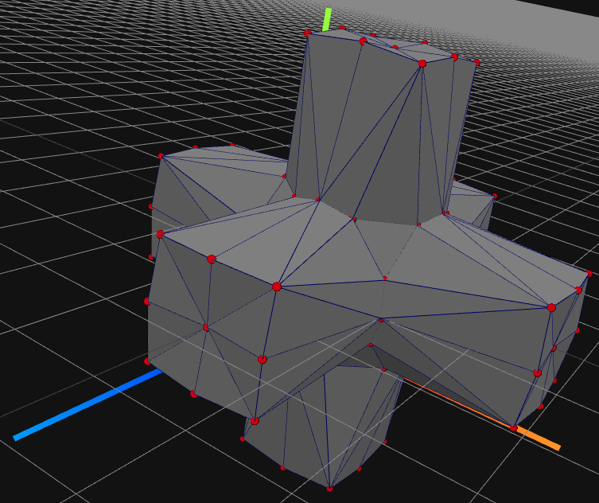 | 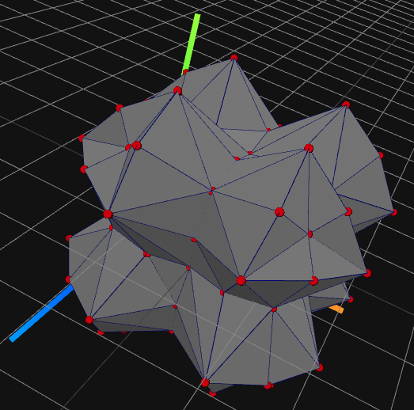 |

CHoCCMesh网格

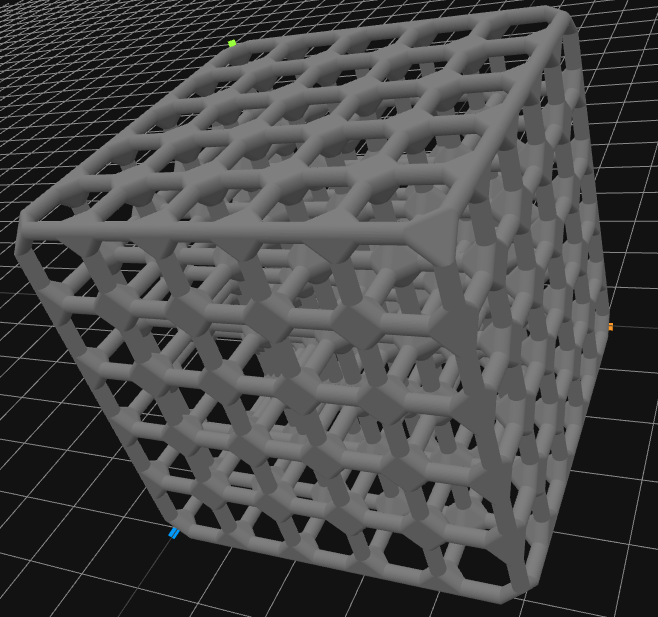

CNTMesh网格

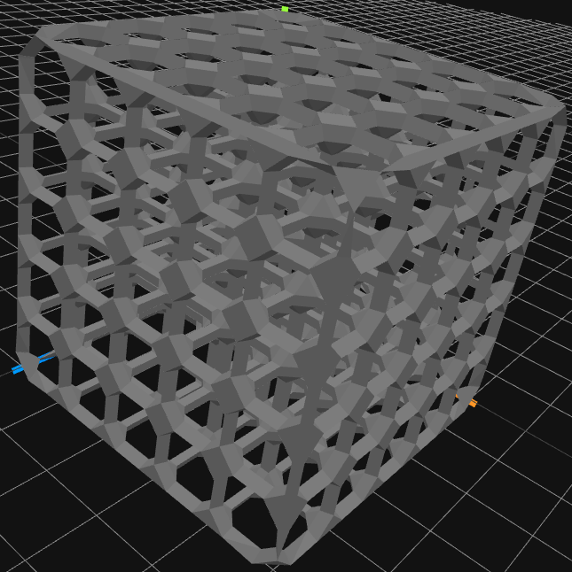


可以看到我们的连接效果与原文的图片比较类似。

# 开源声明与环境配置

## 开源声明

本人对代码享有所有权，除了库函数以外并没有使用任何其他的仓库的代码，所有文件中的代码独立完成。遵循MIT开源协议。同时感谢浙江大学李明老师及其附属团队与论文[^1]的原作者。

## 环境配置

- 系统环境：ubuntu 22.04
- 编译环境：vscode
- 图片展示插件：vscode-3d-preview
- 编译环境：MinGW
- 代码运行依赖库：Eigen

# 引用

[^1]: Wu Y, Gupta A, Kurzeja K, et al. Chocc: convex hull of cospherical circles and applications to lattices[J]. Computer-Aided Design, 2020, 129: 102903.

[^2]: Barbier A, Galin E. Fast distance computation between a point and cylinders, cones, line-swept spheres and cone-spheres. J Graph Tools 2004;9(2):11–9.

[^3]: 使用 [vscode-3d-preview](https://marketplace.visualstudio.com/items?itemName=tatsy.vscode-3d-preview)

[^4]:关于如何转换，见[CGAL 5.6 - 二维阿波罗尼乌斯图（德劳奈圆盘图）：用户手册](https://doc.cgal.org/latest/Apollonius_graph_2/index.html#Chapter_2D_Apollonius_Graphs)，或者直接调用程序


